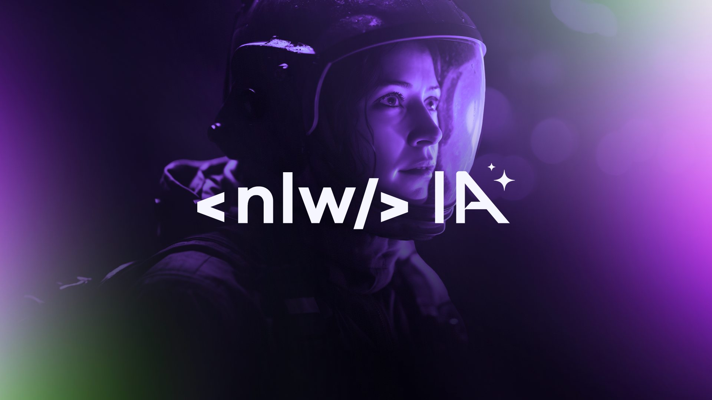

<p align="center">
  
</p>

<!-- ## 🖥️ Project

This is a project using AI to summarize and transcribe Shorts by receiving a youtube URL.

## 🚀 Technologies


This project was developed during the Rocketseat's NLW-AI using the following technologies:

- HTML
- CSS
- JavaScript
- Node.js
- Git e Github
- AI model: GPT 3.5

## 👩🏻‍💻 How to run the project
- Clone or download the ZIP file
- To install the dependencies run:
```
npm install
# ou
yarn install
# ou
pnpm install
```
After installed run: 
```bash
npm run dev
# ou
yarn dev
# ou
pnpm dev
```

## 🔖 Layout

You can see the project layout through
[here](https://www.figma.com/community/file/1282823495335498952/Shorts-Summary-•-Trilha-Foundations).
You must have an account at [Figma](https://www.figma.com) -->
